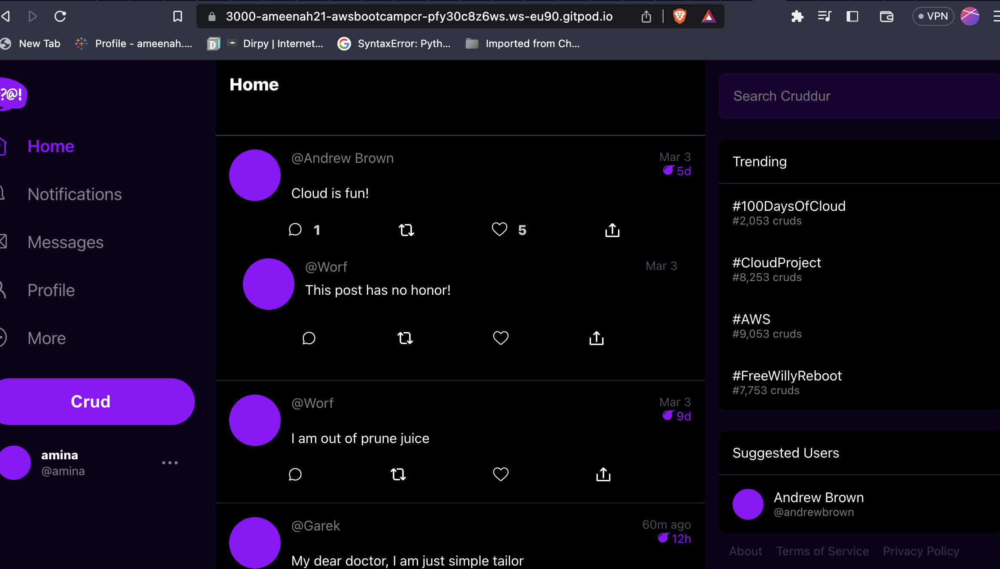
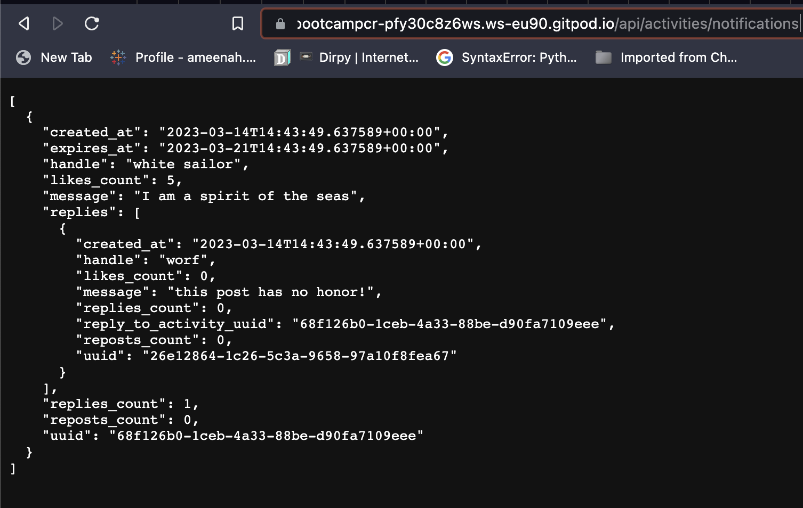
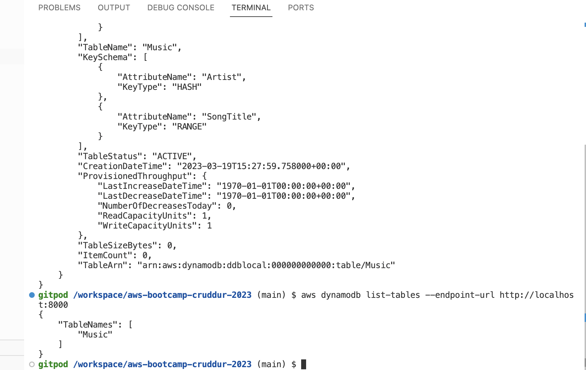
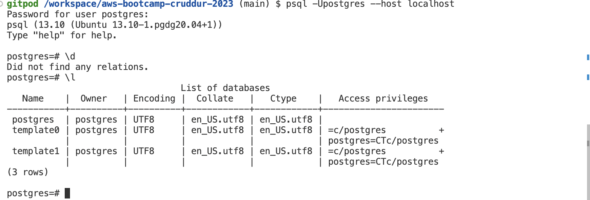

# Week 1 — App Containerization
This week, we set and configured gitpod workspace. We  up docker files for the apps and configured docker compose files. We created containers for the frontend, backend, postgres and dynamodb and ensured that the applications were running in their containers. 
#Frontend

#Backend

#Dynamodb

#Postgres

#Ports

/Users/apple/Desktop/Cruddur/aws-bootcamp-cruddur-2023/Images/Week 1/backend.png