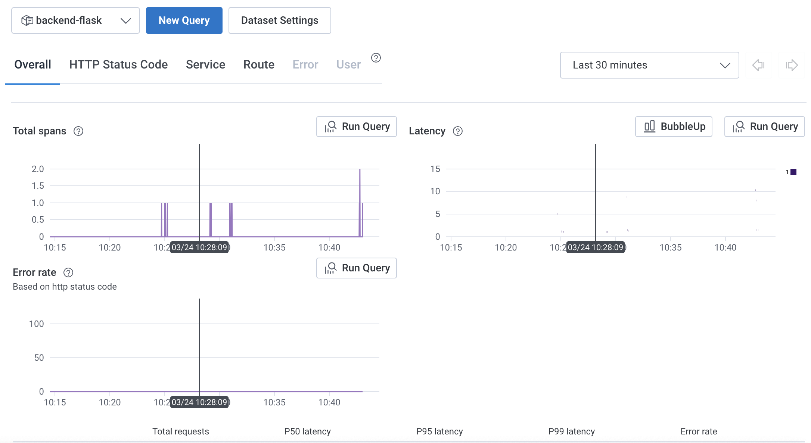
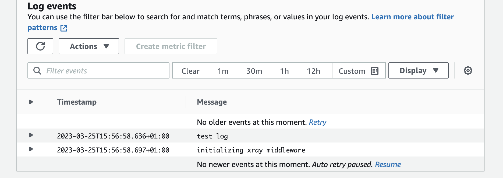
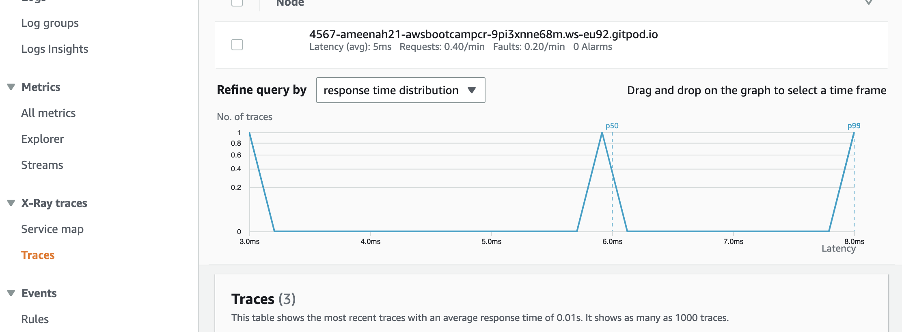

# Week 2 — Distributed Tracing
This week we implemented distributed tracing. We wrote and implemented the code for logging and tracing using honeycomb, cloudwatch and AWS Xray. 

# Honeycomb logs

# Cloudwatch logs

# logevents

# X-ray Traces
