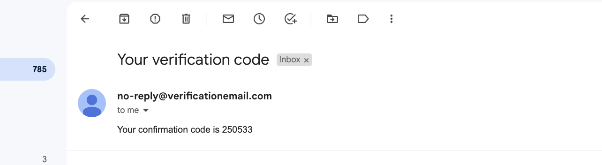
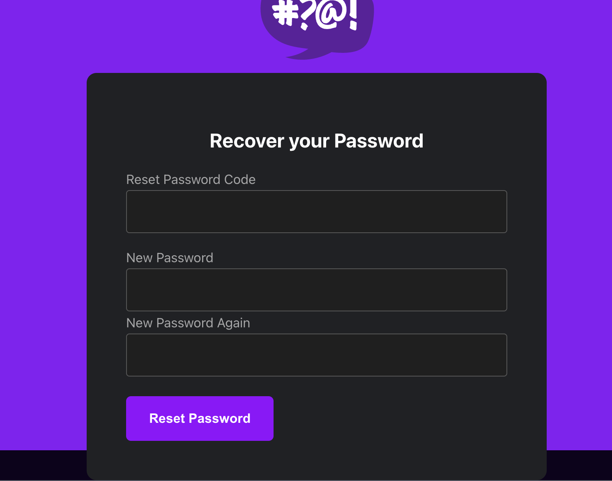
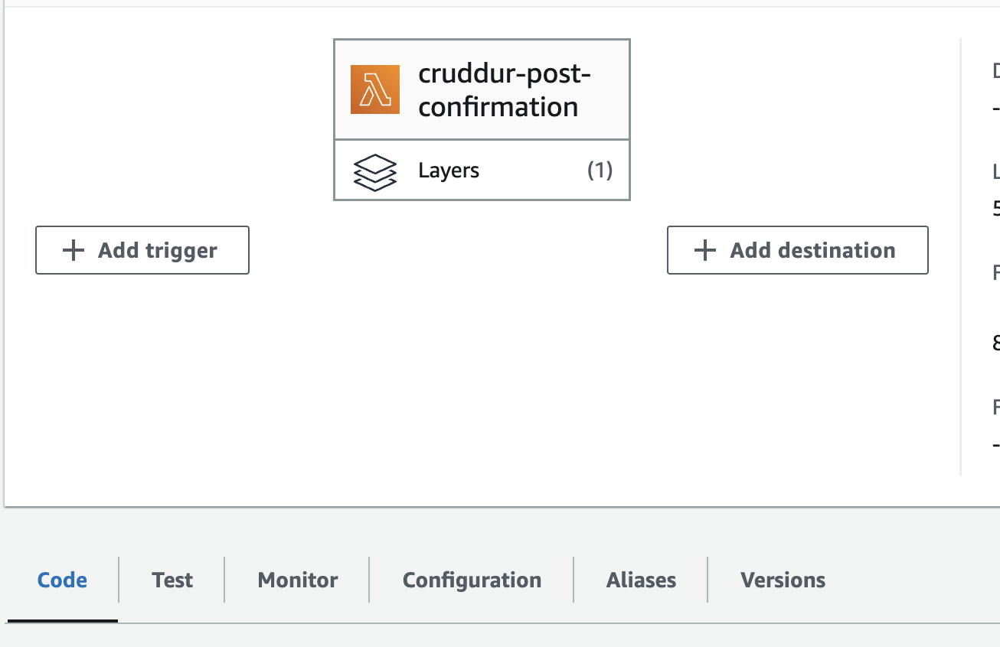
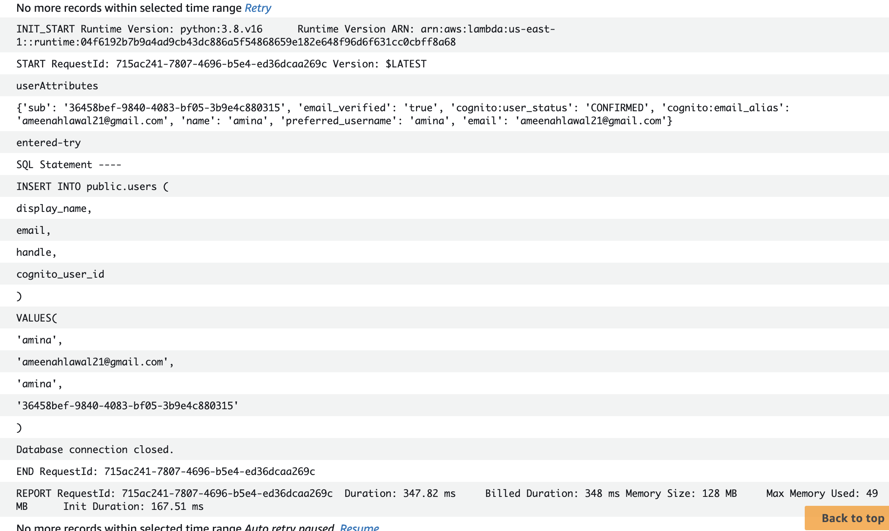

# Week 3 — Decentralized Authentication
This week we implemented user authentication using AWS cognito. We created a cognito pool, user group and also created an AWS lambda function to trigger RDS to add new users to our database whenever they are created.

# email verification

# Password Recovery

# lambda

# lambda logs

